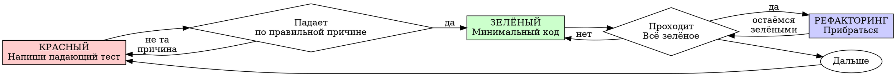

# Test-Driven Development (TDD)

> Источник: ~/.config/opencode/superpowers/skills/test-driven-development/SKILL.md, upstream 6efe32c (2026-04-23).
> Адресат: worker-implementer — пассивный процесс: читаешь и следуешь в рамках своей единственной задачи, без диспетчеризации.

## Трассировка адаптации

| Пункт upstream | Судьба |
|---|---|
| Iron Law, цикл RED-GREEN-REFACTOR, обязательные верификации RED/GREEN, dot-диаграмма | **сохранено** дословно (перевод) |
| Таблица рационализаций (11), red flags (13), «Why Order Matters» (5 аргументов), анти-паттерны тестирования (3), чеклист верификации (8), «When Stuck» (4), примеры Good/Bad, пример багфикса | **сохранено полностью** по смыслу дословно (H7) |
| `npm test <путь>` | **заменено**: точечный прогон — `npx vitest run <путь>` (стек проекта — vitest); полный — `npm run check` |
| «Ask your human partner» (исключения из Iron Law) | **заменено**: явное разрешение владельца; воркер эскалирует запрос через executor-lead, сам не решает |
| Чеклист верификации | **дополнено**: механика {{tool.todowrite}} — один пункт на чекбокс |
| Ссылка на внешний `@testing-anti-patterns.md` | **отброшено**: reference-файл вне шаблона; суть (3 пункта) встроена в раздел «Анти-паттерны тестирования» |
| Контур лица | **добавлено**: до задачи — `wolf search "worker-implementer playbook"` (брать наибольшую версию) |

## Обзор

Сначала напиши тест. Посмотри, как он падает. Напиши минимальный код, чтобы он прошёл.

**Принцип:** если ты не видел, как тест падает, ты не знаешь, проверяет ли он то, что нужно.

**Нарушение буквы правил — это нарушение духа правил.**

## Когда применять

**Всегда:**
- Новые фичи
- Багфиксы
- Рефакторинг
- Изменения поведения

**Исключения (только с явного разрешения владельца — эскалируй через executor-lead):**
- Одноразовые прототипы
- Генерированный код
- Конфигурационные файлы

Думаешь «пропущу TDD только этот раз»? Стоп. Это рационализация.

## Iron Law

```
НИКАКОГО ПРОДАКШЕН-КОДА БЕЗ ПАДАЮЩЕГО ТЕСТА
```

Написал код до теста? Удали. Начни заново.

**Без исключений:**
- Не оставляй «как референс»
- Не «адаптируй» его при написании тестов
- Не смотри на него
- Удалить означает удалить

Реализуй с нуля из тестов. Точка.

## Красный-Зелёный-Рефакторинг



### КРАСНЫЙ — напиши падающий тест

Напиши один минимальный тест, показывающий, что должно происходить.

<Good>
```typescript
test('повторяет неудачную операцию 3 раза', async () => {
  let attempts = 0;
  const operation = () => {
    attempts++;
    if (attempts < 3) throw new Error('fail');
    return 'success';
  };

  const result = await retryOperation(operation);

  expect(result).toBe('success');
  expect(attempts).toBe(3);
});
```
Ясное имя, тестирует реальное поведение, одно
</Good>

<Bad>
```typescript
test('retry works', async () => {
  const mock = jest.fn()
    .mockRejectedValueOnce(new Error())
    .mockRejectedValueOnce(new Error())
    .mockResolvedValueOnce('success');
  await retryOperation(mock);
  expect(mock).toHaveBeenCalledTimes(3);
});
```
Расплывчатое имя, тестирует мок, а не код
</Bad>

**Требования:**
- Одно поведение
- Ясное имя
- Реальный код (моки — только при неизбежности)

### Верифицируй КРАСНЫЙ — посмотри, как падает

**ОБЯЗАТЕЛЬНО. Никогда не пропускай.**

```bash
npx vitest run <путь-к-тесту>
```

Подтверди:
- Тест падает (а не ошибается)
- Сообщение об ошибке ожидаемое
- Падает из-за отсутствия фичи (не из-за опечаток)

**Тест проходит?** Ты тестируешь существующее поведение. Почини тест.

**Тест ошибается?** Почини ошибку, гоняй, пока не упадёт корректно.

### ЗЕЛЁНЫЙ — минимальный код

Напиши простейший код, чтобы тест прошёл.

<Good>
```typescript
async function retryOperation<T>(fn: () => Promise<T>): Promise<T> {
  for (let i = 0; i < 3; i++) {
    try {
      return await fn();
    } catch (e) {
      if (i === 2) throw e;
    }
  }
  throw new Error('unreachable');
}
```
Ровно столько, чтобы пройти
</Good>

<Bad>
```typescript
async function retryOperation<T>(
  fn: () => Promise<T>,
  options?: {
    maxRetries?: number;
    backoff?: 'linear' | 'exponential';
    onRetry?: (attempt: number) => void;
  }
): Promise<T> {
  // YAGNI
}
```
Оверинжиниринг
</Bad>

Не добавляй фичи, не рефакторь другой код, не «улучшай» сверх теста.

### Верифицируй ЗЕЛЁНЫЙ — посмотри, как проходит

**ОБЯЗАТЕЛЬНО.**

```bash
npx vitest run <путь-к-тесту>
```

Подтверди:
- Тест проходит
- Остальные тесты всё ещё проходят
- Вывод чистый (без ошибок и предупреждений)

**Тест упал?** Чини код, а не тест.

**Другие тесты упали?** Чини сейчас.

### РЕФАКТОРИНГ — приберись

Только после зелёного:
- Убери дублирование
- Улучши имена
- Вынеси хелперы

Тесты остаются зелёными. Поведение не добавляется.

### Повтори

Следующий падающий тест для следующей фичи.

## Хорошие тесты

| Качество | Хорошо | Плохо |
|---------|------|-----|
| **Минимальность** | Одно поведение. «И» в имени? Раздели. | `test('проверяет email, домен и пробелы')` |
| **Ясность** | Имя описывает поведение | `test('test1')` |
| **Намерение** | Демонстрирует желаемый API | Затуманивает, что код должен делать |

## Почему важен порядок

**«Я напишу тесты после, чтобы проверить, что работает»**

Тесты, написанные после кода, проходят сразу. Прохождение сразу не доказывает ничего:
- Может тестировать не то
- Может тестировать реализацию, а не поведение
- Может упускать пограничные случаи, которые ты забыл
- Ты никогда не видел, как тест ловит баг

Тест-первый заставляет увидеть падение теста — доказательство, что он реально что-то проверяет.

**«Я уже вручно протестировал все пограничные случаи»**

Ручное тестирование ад-хок. Ты думаешь, что проверил всё, но:
- Нет записи о том, что проверено
- Нельзя перезапустить при изменении кода
- Легко забыть случаи под давлением
- «Работало, когда я пробовал» ≠ исчерпывающе

Автотесты систематичны. Они выполняются одинаково каждый раз.

**«Удалить X часов работы расточительно»**

Ошибка невозвратных издержек. Время уже потрачено. Выбор сейчас:
- Удалить и переписать по TDD (ещё X часов, высокая уверенность)
- Оставить и дописать тесты после (30 минут, низкая уверенность, вероятные баги)

«Расточительство» — держать код, которому не можешь доверять. Работающий код без настоящих тестов — техдолг.

**«TDD догматично, прагматизм означает адаптацию»**

TDD — И есть прагматизм:
- Находит баги до коммита (быстрее отладки после)
- Предотвращает регрессии (тесты ловят поломки сразу)
- Документирует поведение (тесты показывают, как использовать код)
- Даёт рефакторинг (меняй свободно, тесты ловят поломки)

«Прагматичные» сокращения = отладка в проде = медленнее.

**«Тесты после достигают тех же целей — важен дух, а не ритуал»**

Нет. Тесты-после отвечают «что это делает?». Тесты-первый отвечают «что это должно делать?».

Тесты-после смещены твоей реализацией: ты тестируешь то, что построил, а не то, что требуется. Верифицируешь запомненные пограничные случаи, а не обнаруженные.

Тест-первый заставляет обнаружить пограничные случаи до реализации. Тесты-после проверяют, что ты всё запомнил (ты не запомнил).

30 минут тестов после ≠ TDD. Получаешь покрытие, теряешь доказательство, что тесты работают.

## Распространённые рационализации

| Оправдание | Реальность |
|--------|---------|
| «Слишком просто, чтобы тестировать» | Простой код ломается. Тест занимает 30 секунд. |
| «Напишу тесты после» | Тесты, проходящие сразу, не доказывают ничего. |
| «Тесты после достигают тех же целей» | Тесты-после = «что это делает?». Тесты-первый = «что это должно делать?» |
| «Уже протестировал вручную» | Ад-хок ≠ систематично. Нет записи, нельзя перезапустить. |
| «Удалить X часов работы расточительно» | Ошибка невозвратных издержек. Держать непроверенный код — техдолг. |
| «Оставлю как референс, напишу тесты с нуля» | Ты его адаптируешь. Это тесты-после. Удалить = удалить. |
| «Нужно сначала поисследовать» | Ок. Выброси исследование, начни с TDD. |
| «Тест сложный — дизайн неясен» | Слушай тест. Сложно тестировать = сложно использовать. |
| «TDD меня замедлит» | TDD быстрее отладки. Прагматизм = тест-первый. |
| «Ручной тест быстрее» | Ручной не доказывает пограничные случаи. Перепроверять при каждом изменении. |
| «В существующем коде нет тестов» | Ты его улучшаешь. Добавляй тесты для существующего кода. |

## Red flags — ОСТАНОВИСЬ и начни заново

- Код до теста
- Тест после реализации
- Тест проходит сразу
- Не можешь объяснить, почему тест упал
- Тесты «добавим позже»
- Рационализация «только этот раз»
- «Я уже вручную протестировал»
- «Тесты после достигают той же цели»
- «Дело в духе, а не в ритуале»
- «Оставлю как референс» или «адаптирую существующий код»
- «Уже потратил X часов, удалять расточительно»
- «TDD догматично, я прагматик»
- «Это другой случай, потому что...»

**Любой из этих пунктов означает: удали код. Начни заново по TDD.**

## Пример: багфикс

**Баг:** принимается пустой email

**КРАСНЫЙ**
```typescript
test('отклоняет пустой email', async () => {
  const result = await submitForm({ email: '' });
  expect(result.error).toBe('Email required');
});
```

**Верифицируй КРАСНЫЙ**
```bash
$ npx vitest run <путь-к-тесту>
FAIL: expected 'Email required', got undefined
```

**ЗЕЛЁНЫЙ**
```typescript
function submitForm(data: FormData) {
  if (!data.email?.trim()) {
    return { error: 'Email required' };
  }
  // ...
}
```

**Верифицируй ЗЕЛЁНЫЙ**
```bash
$ npx vitest run <путь-к-тесту>
PASS
```

**РЕФАКТОРИНГ**
Вынеси валидацию для нескольких полей, если нужно.

## Чеклист верификации

Перед отметкой работы как завершённой размести пункты в {{tool.todowrite}} (один пункт — один чекбокс) и отметь по факту:

- [ ] У каждой новой функции/метода есть тест
- [ ] Видел каждый тест падающим до реализации
- [ ] Каждый тест падал по ожидаемой причине (фича отсутствует, не опечатка)
- [ ] Написал минимальный код для прохождения каждого теста
- [ ] Все тесты проходят
- [ ] Вывод чистый (без ошибок и предупреждений)
- [ ] Тесты используют реальный код (моки — только при неизбежности)
- [ ] Пограничные случаи и ошибки покрыты

Не можешь отметить все пункты? Ты пропустил TDD. Начни заново.

## Когда застрял

| Проблема | Решение |
|---------|----------|
| Не знаю, как тестировать | Напиши желаемый API. Сначала напиши assertion. Запроси подсказку владельца через executor-lead. |
| Тест слишком сложный | Дизайн слишком сложный. Упрости интерфейс. |
| Приходится мокать всё | Код слишком связан. Используй внедрение зависимостей. |
| Подготовка теста огромная | Вынеси хелперы. Всё ещё сложно? Упрости дизайн. |

## Интеграция с отладкой

Найден баг? Напиши падающий тест, воспроизводящий его. Пройди цикл TDD. Тест доказывает фикс и предотвращает регрессию.

Никогда не чини баги без теста.

## Анти-паттерны тестирования

- Тестирование поведения мока вместо реального поведения
- Тест-методы в продакшен-классах
- Моки без понимания зависимостей

## Интеграция с Wolf

- **Контур лица**: до задачи — `wolf search "worker-implementer playbook"` (наибольшая версия); методика эволюционирует в памяти, этот файл — только процесс.
- **Полная верификация** в конце задачи — `npm run check`.
- **Урок**: наткнулся на нетривиальную ловушку TDD-цикла — зафиксируй `wolf add --type lesson`, чтобы следующий воркер её обошёл.

## Финальное правило

```
Продакшен-код → тест существует и упал первым
Иначе → не TDD
```

Без исключений — кроме явного разрешения владельца.
