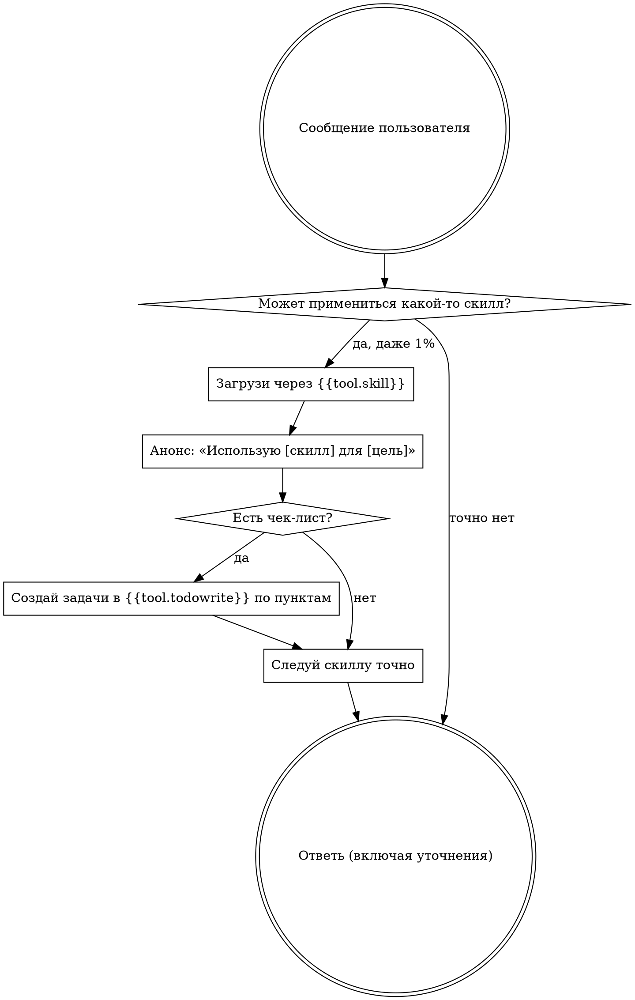

# using-skills — как пользоваться скиллами

> Источник: ~/.config/opencode/superpowers/skills/using-superpowers/SKILL.md,
> upstream 6efe32c (2026-04-23).

## Трассировка переноса

| Пункт источника | Судьба |
| --------------- | ------ |
| Frontmatter name/description | Сохранено (description переработан) |
| SUBAGENT-STOP-блок | Заменено: воркеры L2 — диспетчерский контур отключён; скиллы пассивны (воркер читает процесс своей единственной задачи, но не диспетчит и не выбирает) |
| EXTREMELY-IMPORTANT (1%-правило) | Сохранено, по смыслу дословно |
| Instruction Priority (CLAUDE.md > skills > system prompt) | Заменено: лестница «правила проекта/память Wolf (AGENTS.md, `wolf search`) > скиллы > дефолт-поведение» |
| How to Access Skills (разделы Claude Code / Copilot / Gemini) | Заменено: один нейтральный вызов {{tool.skill}} |
| Platform Adaptation (tool mappings, references/*.md) | Отброшено: платформенная специфика — зона рендерера (подстановка имён тулов через плейсхолдеры) |
| The Rule + flowchart | Сохранено; Skill-тул → {{tool.skill}}, TodoWrite → {{tool.todowrite}}, Task (субагенты) → {{tool.task}}; вершина «About to EnterPlanMode?» — отброшена (концепт Claude Code, в Wolf нет аналога) |
| Red Flags — таблица рационализаций | Сохранено ПОЛНОСТЬЮ: 12/12, по смыслу дословно (upstream запрещает правки списка) |
| Skill Priority (process → implementation) | Сохранено |
| Skill Types (rigid / flexible) | Сохранено |
| User Instructions (WHAT ≠ HOW) | Сохранено |

## Воркеры L2 — пассивный режим

Если ты воркер L2 (диспетчерский контур отключён): скиллы для тебя —
**пассивные процессы**. Читай процесс своей единственной задачи (дисциплина
из подзадачи — например TDD), но не диспетчь скиллы, не выбирай их сам и не
запускай перебор применимости. Спавн субагентов не твой — у воркеров
{{tool.task}} отключён; нужна чужая работа — верни диспетчеру «нужен
executor: <причина>».

## Правило

**Загружай релевантный или запрошенный скилл ДО любого ответа или
действия.** Даже 1% шанс применимости → загрузи скилл и проверь. Если
загруженный скилл оказался неподходящим — использовать его не обязан.

Если думаешь, что скилл может примениться к твоей задаче, — у тебя нет
выбора: загрузи его. Это не обсуждается и не является опциональным.
Рационализировать выход из этого нельзя.

## Лестница приоритетов

Скиллы перекрывают дефолтное поведение, но **правила проекта и память Wolf
всегда выше**:

1. **Правила проекта и память Wolf** (AGENTS.md проекта; актуальные
   правила, решения и уроки из памяти — `wolf search`, `wolf brief`) —
   высший приоритет.
2. **Скиллы** — перекрывают дефолтное поведение там, где не конфликтуют
   с п. 1.
3. **Дефолт-поведение** — низший приоритет.

Если правила проекта говорят «без TDD», а скилл требует «всегда TDD» —
следуй правилам проекта. Владелец управляет.

## Red Flags

Эти мысли означают СТОП — ты рационализируешь:

| Мысль | Реальность |
| ----- | ---------- |
| «Это просто вопрос» | Вопросы — это задачи. Проверь скиллы. |
| «Сначала мне нужен больше контекста» | Проверка скиллов — ДО уточняющих вопросов. |
| «Дай сначала осмотрю кодовую базу» | Скиллы говорят, КАК осматривать. Сначала проверь. |
| «Быстро гляну git/файлы» | У файлов нет контекста разговора. Проверь скиллы. |
| «Сначала соберу информацию» | Скиллы говорят, КАК собирать информацию. |
| «Тут не нужен формальный скилл» | Если скилл существует — используй. |
| «Я помню этот скилл» | Скиллы эволюционируют. Читай актуальную версию. |
| «Это не считается задачей» | Действие = задача. Проверь скиллы. |
| «Скилл — из пушки по воробьям» | Простое становится сложным. Используй его. |
| «Сделаю сперва вот это одно» | Проверь ДО того, как что-либо делать. |
| «Это ощущается продуктивным» | Недисциплинированные действия — впустую. Скиллы предотвращают это. |
| «Я знаю, что это значит» | Знать концепцию ≠ использовать скилл. Загрузи. |

## Порядок скиллов

Когда применимо несколько — порядок такой:

1. **Сначала process-скиллы** (wolf-brainstorm, wolf-debug — класс
   brainstorming/debugging) — они определяют, КАК подойти к задаче.
2. **Потом implementation-скиллы** — они ведут исполнение.

«Построим X» → сначала brainstorming-класс, затем implementation.
«Почини баг» → сначала debugging-класс, затем доменные скиллы.

Диспетчеризация исполнения на воркеров — через {{tool.task}} (зона
координаторов L0/L1, не воркеров).

## Типы скиллов

**Rigid** (TDD, wolf-debug): следуй точно. Не адаптируй дисциплину.

**Flexible** (паттерны): адаптируй принципы к контексту.

Скилл сам говорит, какого он типа.

## Инструкции пользователя

Инструкции говорят ЧТО, а не КАК. «Добавь X» или «Почини Y» не означает
пропускать процессы.
