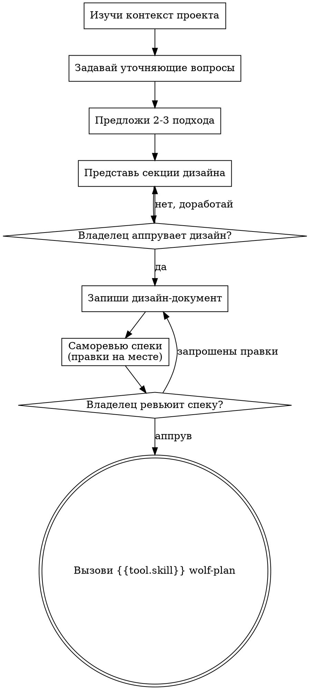

# wolf-brainstorm: идея → дизайн

Превращай идеи в законченные дизайны и спеки через естественный совместный диалог.

Начни с понимания контекста проекта, затем задавай вопросы по одному, чтобы уточнить идею. Когда понял, что строится, — представь дизайн и получи аппрув владельца.

Это Discovery-режим координатора: ты исследуешь и проясняешь, а не строишь.

<HARD-GATE>
Не вызывай ни один скилл реализации, не пиши код, не создавай скелет проекта и не предпринимай никаких действий реализации, пока не представил дизайн и владелец его не аппробовал. Это касается КАЖДОГО проекта независимо от воспринимаемой простоты.
</HARD-GATE>

## Анти-паттерн: «Это слишком просто, чтобы нужен дизайн»

Через этот процесс проходит каждый проект. Туду-лист, утилита из одной функции, правка конфига — все они. «Простые» проекты — именно там, где непроверенные предположения дают больше всего лишней работы. Дизайн может быть коротким (несколько предложений для действительно простых проектов), но ты ОБЯЗАН его представить и получить аппрув.

## Чеклист

Создай задачи по каждому пункту через {{tool.todowrite}} и выполняй по порядку:

1. **Изучи контекст проекта** — файлы, документация, недавние коммиты
2. **Задавай уточняющие вопросы** — по одному; цель, ограничения, критерии успеха
3. **Предложи 2–3 подхода** — с трейд-оффами и своей рекомендацией
4. **Представь дизайн** — секциями, масштаб каждой под её сложность; аппрув после каждой секции
5. **Запиши дизайн-документ** — в каталог спек проекта (по умолчанию `docs/specs/YYYY-MM-DD-<тема>-design.md`; предпочтения проекта приоритетнее дефолта) и закоммить (правило проекта: коммит после завершённой работы)
6. **Саморевью спеки** — быстрая проверка на плейсхолдеры, противоречия, двусмысленность, scope (см. ниже)
7. **Ревью спеки владельцем** — владелец читает файл спеки до продолжения
8. **Переход к планированию** — вызови {{tool.skill}} wolf-plan

**Worktree этот скилл НЕ создаёт** — изоляция рабочего каталога начинается только на этапе исполнения (см. wolf-sdd / wolf-execute, правило `.worktrees/<имя-задачи>`).

## Ход процесса

**Терминальное состояние — вызов wolf-plan.** Не вызывай скиллы реализации и никакие другие. ЕДИНСТВЕННЫЙ скилл после wolf-brainstorm — wolf-plan.

## Процесс

**Понимание идеи:**

- Сначала посмотри текущее состояние проекта (файлы, документация, недавние коммиты)
- До детальных вопросов оцени масштаб: если запрос описывает несколько независимых подсистем (например, «платформа с чатом, хранилищем, биллингом и аналитикой») — сразу скажи об этом. Не трать вопросы на уточнение деталей проекта, который сначала нужно декомпозировать.
- Если проект слишком велик для одной спеки — помоги владельцу разбить его на подпроекты: какие части независимы, как связаны, в каком порядке строить. Затем прогоняй первый подпроект через обычный флоу. Каждый подпроект получает свой цикл спека → план → реализация.
- Для проектов подходящего масштаба задавай вопросы по одному
- Предпочитай вопросы с вариантами ответа, но открытые тоже допустимы
- Только один вопрос на сообщение — если тема требует глубины, разбей на несколько вопросов
- Фокус на понимании: цель, ограничения, критерии успеха

**Исследование подходов:**

- Предложи 2–3 разных подхода с трейд-оффами
- Представляй варианты разговорно, со своей рекомендацией и обоснованием
- Веди с рекомендуемого варианта и объясни, почему именно он

**Презентация дизайна:**

- Когда понял, что строишь, — представь дизайн
- Масштабируй каждую секцию под её сложность: несколько предложений для простого, до 200–300 слов для нюансированного
- После каждой секции спрашивай, всё ли верно пока
- Покрой: архитектуру, компоненты, поток данных, обработку ошибок, тестирование
- Будь готов вернуться и уточнить, если что-то не сходится

**Дизайн для изоляции и ясности:**

- Дели систему на маленькие блоки, каждый с одной ясной целью, общающиеся через определённые интерфейсы, — понятные и тестируемые независимо
- Для каждого блока отвечай: что он делает, как им пользоваться, от чего он зависит?
- Можно ли понять блок, не читая его внутренности? Можно ли менять внутренности, не ломая потребителей? Если нет — границы требуют доработки.
- Маленькие чётко очерченные блоки проще и для тебя: над кодом, который держится в контексте целиком, ты рассуждаешь лучше, а правки точечнее. Разросшийся файл — часто сигнал, что он делает слишком много.

**Работа в существующей кодовой базе:**

- Изучи текущую структуру до предложения правок. Следуй существующим паттернам.
- Если существующий код мешает работе (файл разросся, границы размыты, ответственности перепутаны) — включи точечные улучшения в дизайн, как хороший разработчик, улучшающий код, в котором работает.
- Не предлагай несвязанный рефакторинг. Фокус на том, что служит текущей цели.

## После дизайна

**Документация:**

- Запиши валидированный дизайн (спеку) в каталог спек проекта (по умолчанию `docs/specs/YYYY-MM-DD-<тема>-design.md`; предпочтения проекта приоритетнее)
- Закоммить дизайн-документ (правило проекта: коммит после завершённой работы)
- Ключевые решения дизайна зафиксируй в памяти: `wolf add --type decision` — с обоснованием; они переживут сессию и достанутся исполнителям

**Саморевью спеки:**
После записи спеки посмотри на неё свежим взглядом:

1. **Скан плейсхолдеров:** есть ли «TBD», «TODO», незаполненные секции, размытые требования? Исправь.
2. **Внутренняя согласованность:** противоречат ли секции друг другу? Согласуется ли архитектура с описанием фич?
3. **Проверка scope:** достаточно ли фокусировки для одного плана реализации, или нужна декомпозиция?
4. **Проверка двусмысленности:** можно ли истолковать требование двумя способами? Если да — выбери одну трактовку и сделай явной.

Исправляй на месте. Пересматривать заново не нужно — исправил и двигайся дальше.

**Гейт ревью владельца:**
После прохождения саморевью попроси владельца прочитать записанную спеку до продолжения:

> «Спека записана и закоммичена в `<путь>`. Посмотри её и скажи, нужны ли правки, прежде чем начнём писать план реализации».

Жди ответа. Запрошены правки — внеси и прогони саморевью заново. Продолжай только после аппрува владельца.

**Реализация:**

- Вызови {{tool.skill}} wolf-plan для создания детального плана реализации
- НЕ вызывай никаких других скиллов. Следующий шаг — только wolf-plan.

## Ключевые принципы

- **Один вопрос за раз** — не перегружай несколькими вопросами
- **Предпочитай варианты ответа** — отвечать проще, чем на открытый вопрос
- **Беспощадный YAGNI** — убирай ненужные фичи из всех дизайнов
- **Исследуй альтернативы** — всегда 2–3 подхода до выбора
- **Инкрементальная валидация** — представляй дизайн, получай аппрув, потом дальше
- **Будь гибким** — возвращайся и уточняй, когда что-то не сходится

---

## Трассировка адаптации

> Источник: `~/.config/opencode/superpowers/skills/brainstorming/SKILL.md`, upstream 6efe32c (2026-04-23)

| Пункт источника | Судьба | Почему |
|---|---|---|
| HARD-GATE до аппрува | сохранено | Ядро скилла; «user» → «владелец» |
| Анти-паттерн «слишком просто для дизайна» | сохранено полностью (1/1) | H7 |
| Чеклист (9 пунктов) | сохранено; п.2 (visual companion) отброшен, п.9 → wolf-plan | Браузерный компаньон вне базового набора |
| Пункт «Invoke writing-plans skill» | заменено → `{{tool.skill}} wolf-plan` | H4: терминальное состояние — только wolf-plan |
| TodoWrite | заменено → `{{tool.todowrite}}` | Плейсхолдер |
| Flowchart | сохранено; терминальный узел → wolf-plan | Ядро-флоу |
| «The Process» (5 блоков) | сохранено | Переносимое ядро |
| Путь `docs/superpowers/specs/` | заменено → `docs/specs/…` + предпочтения проекта | Harness-привязка (research §1) |
| Саморевью спеки (4 проверки) | сохранено полностью (4/4) | Чеклист-ядро |
| Гейт ревью владельца | сохранено | Ядро |
| Ключевые принципы (8) | сохранено полностью (8/8) | H7 |
| Visual Companion (секция + `visual-companion.md`) | отброшено | Браузерный компаньон и sibling-файл не переносятся |
| — | добавлено: Discovery-режим; worktree НЕ создаёт; `wolf add --type decision` | Спека §5.2 (архив §2.3), H5-распределение владения worktree |

Перенесённые списки: анти-паттерны 1/1, принципы 8/8, саморевью 4/4.
