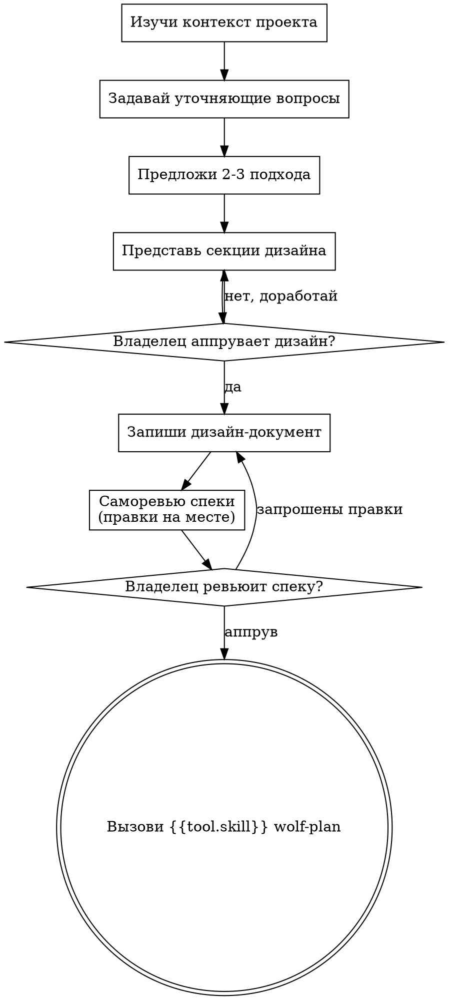

# wolf-brainstorm: идея → дизайн

Превращай идеи в законченные дизайны и спеки через естественный совместный диалог.

Начни с понимания контекста проекта, затем задавай вопросы по одному, чтобы уточнить идею. Когда понял, что строится, — представь дизайн и получи аппрув владельца.

Это Discovery-режим координатора: ты исследуешь и проясняешь, а не строишь.

<HARD-GATE>
Не вызывай ни один скилл реализации, не пиши код, не создавай скелет проекта и не предпринимай никаких действий реализации, пока не представил дизайн и владелец его не аппробовал. Это касается КАЖДОГО проекта независимо от воспринимаемой простоты.
</HARD-GATE>

## Анти-паттерн: «Это слишком просто, чтобы нужен дизайн»

Через этот процесс проходит каждый проект. Туду-лист, утилита из одной функции, правка конфига — все они. «Простые» проекты — именно там, где непроверенные предположения дают больше всего лишней работы. Дизайн может быть коротким (несколько предложений для действительно простых проектов), но ты ОБЯЗАН его представить и получить аппрув.

## Чеклист

Создай задачи по каждому пункту через {{tool.todowrite}} и выполняй по порядку:

1. **Изучи контекст проекта** — файлы, документация, недавние коммиты
2. **Задавай уточняющие вопросы** — по одному; цель, ограничения, критерии успеха
3. **Предложи 2–3 подхода** — с трейд-оффами и своей рекомендацией
4. **Представь дизайн** — секциями, масштаб каждой под её сложность; аппрув после каждой секции
5. **Запиши дизайн-документ** — в каталог спек проекта (по умолчанию `docs/specs/YYYY-MM-DD-<тема>-design.md`; предпочтения проекта приоритетнее дефолта) и закоммить (правило проекта: коммит после завершённой работы)
6. **Саморевью спеки** — быстрая проверка на плейсхолдеры, противоречия, двусмысленность, scope (см. ниже)
7. **Ревью спеки владельцем** — владелец читает файл спеки до продолжения
8. **Переход к планированию** — вызови {{tool.skill}} wolf-plan

**Worktree этот скилл НЕ создаёт** — изоляция рабочего каталога начинается только на этапе исполнения (см. wolf-sdd / wolf-execute, правило `.worktrees/<имя-задачи>`).

## Ход процесса

```dot
digraph wolf_brainstorm {
    "Изучи контекст проекта" [shape=box];
    "Задавай уточняющие вопросы" [shape=box];
    "Предложи 2-3 подхода" [shape=box];
    "Представь секции дизайна" [shape=box];
    "Владелец аппрувает дизайн?" [shape=diamond];
    "Запиши дизайн-документ" [shape=box];
    "Саморевью спеки\n(правки на месте)" [shape=box];
    "Владелец ревьюит спеку?" [shape=diamond];
    "Вызови {{tool.skill}} wolf-plan" [shape=doublecircle];

    "Изучи контекст проекта" -> "Задавай уточняющие вопросы";
    "Задавай уточняющие вопросы" -> "Предложи 2-3 подхода";
    "Предложи 2-3 подхода" -> "Представь секции дизайна";
    "Представь секции дизайна" -> "Владелец аппрувает дизайн?";
    "Владелец аппрувает дизайн?" -> "Представь секции дизайна" [label="нет, доработай"];
    "Владелец аппрувает дизайн?" -> "Запиши дизайн-документ" [label="да"];
    "Запиши дизайн-документ" -> "Саморевью спеки\n(правки на месте)";
    "Саморевью спеки\n(правки на месте)" -> "Владелец ревьюит спеку?";
    "Владелец ревьюит спеку?" -> "Запиши дизайн-документ" [label="запрошены правки"];
    "Владелец ревьюит спеку?" -> "Вызови {{tool.skill}} wolf-plan" [label="аппрув"];
}
```

**Терминальное состояние — вызов wolf-plan.** Не вызывай скиллы реализации и никакие другие. ЕДИНСТВЕННЫЙ скилл после wolf-brainstorm — wolf-plan.

## Процесс

**Понимание идеи:**

- Сначала посмотри текущее состояние проекта (файлы, документация, недавние коммиты)
- До детальных вопросов оцени масштаб: если запрос описывает несколько независимых подсистем (например, «платформа с чатом, хранилищем, биллингом и аналитикой») — сразу скажи об этом. Не трать вопросы на уточнение деталей проекта, который сначала нужно декомпозировать.
- Если проект слишком велик для одной спеки — помоги владельцу разбить его на подпроекты: какие части независимы, как связаны, в каком порядке строить. Затем прогоняй первый подпроект через обычный флоу. Каждый подпроект получает свой цикл спека → план → реализация.
- Для проектов подходящего масштаба задавай вопросы по одному
- Предпочитай вопросы с вариантами ответа, но открытые тоже допустимы
- Только один вопрос на сообщение — если тема требует глубины, разбей на несколько вопросов
- Фокус на понимании: цель, ограничения, критерии успеха

**Исследование подходов:**

- Предложи 2–3 разных подхода с трейд-оффами
- Представляй варианты разговорно, со своей рекомендацией и обоснованием
- Веди с рекомендуемого варианта и объясни, почему именно он

**Презентация дизайна:**

- Когда понял, что строишь, — представь дизайн
- Масштабируй каждую секцию под её сложность: несколько предложений для простого, до 200–300 слов для нюансированного
- После каждой секции спрашивай, всё ли верно пока
- Покрой: архитектуру, компоненты, поток данных, обработку ошибок, тестирование
- Будь готов вернуться и уточнить, если что-то не сходится

**Дизайн для изоляции и ясности:**

- Дели систему на маленькие блоки, каждый с одной ясной целью, общающиеся через определённые интерфейсы, — понятные и тестируемые независимо
- Для каждого блока отвечай: что он делает, как им пользоваться, от чего он зависит?
- Можно ли понять блок, не читая его внутренности? Можно ли менять внутренности, не ломая потребителей? Если нет — границы требуют доработки.
- Маленькие чётко очерченные блоки проще и для тебя: над кодом, который держится в контексте целиком, ты рассуждаешь лучше, а правки точечнее. Разросшийся файл — часто сигнал, что он делает слишком много.

**Работа в существующей кодовой базе:**

- Изучи текущую структуру до предложения правок. Следуй существующим паттернам.
- Если существующий код мешает работе (файл разросся, границы размыты, ответственности перепутаны) — включи точечные улучшения в дизайн, как хороший разработчик, улучшающий код, в котором работает.
- Не предлагай несвязанный рефакторинг. Фокус на том, что служит текущей цели.

## Выход: requirements.md (v2 — анатомия §4.1 спеки конвейера)

Диалог с владельцем завершается артефактом `docs/dev/<дата>-<slug>/requirements.md`.
Папку создаёт `wolf scaffold artifact <slug>` — файлы артефактов вручную не создавать.

Структура документа — 7 секций:

1. Контекст и проблема — зачем, прозой, бизнес-языком; метрика успеха.
2. Область — что входит; НЕ входит (не-цели уровня требований).
3. Глоссарий — бизнес-термины фичи, если появились новые.
4. Функциональные требования — записи REQ-NN.
5. Нефункциональные (NFR-NN) — производительность, безопасность, совместимость;
   каждая с измеримым критерием.
6. Ограничения и допущения — что считаем данным.
7. Журнал изменений (CR) — append-only: дата, затронутый REQ/NFR, что/почему,
   кем утверждено, downstream-перегенерации.

Анатомия записи (обязательные поля каждой записи REQ/NFR):

- История: Как <роль>, я хочу <возможность>, чтобы <выгода>.
- Требование: Когда <условие>, система должна <поведение>.
- Обоснование: <зачем это бизнесу — словами владельца>.
- AC: <измеримый критерий; нетривиальные — Given/When/Then>.
- Приоритет: Must | Should | Could.
- Источник: <диалог <дата> / жалоба mem-… / ревью-линза>.

Критерии готовности записи (гейт линзы полноты; часть проверяет линт):
одно требование — одна запись; есть история И формальная запись; есть AC
(REQ без AC — находка линта); есть источник; неопределённость помечена
`[НЕОПРЕДЕЛЕНО: вопрос]`, не сжата; владелец пересказывает требование своими
словами — не может, это дефект требования, а не читателя.

Язык: полные предложения, ноль сленга, термины домена без сокращений, новое
понятие объясняется при первом употреблении, смысловое сжатие запрещено.

## Второй режим: roadmap-триаж

Диалог с владельцем по кандидатурам волн → вердикт по каждой: «волна N / бэклог /
отклонено + причина». Запись — перемещением, не копированием (пункт живёт ровно
в одном файле; дубль — находка линта doctor):

- волна N → `docs/dev/roadmap/wave-N.md` (состав волны, источник вердикта);
- бэклог → `docs/dev/roadmap/backlog.md`;
- отклонено → `docs/dev/roadmap/rejected.md` (+ причина).

## Ключевые принципы

- **Один вопрос за раз** — не перегружай несколькими вопросами
- **Предпочитай варианты ответа** — отвечать проще, чем на открытый вопрос
- **Беспощадный YAGNI** — убирай ненужные фичи из всех дизайнов
- **Исследуй альтернативы** — всегда 2–3 подхода до выбора
- **Инкрементальная валидация** — представляй дизайн, получай аппрув, потом дальше
- **Будь гибким** — возвращайся и уточняй, когда что-то не сходится

---

## Трассировка адаптации

> Источник: `~/.config/opencode/superpowers/skills/brainstorming/SKILL.md`, upstream 6efe32c (2026-04-23)

| Пункт источника                                   | Судьба                                                                      | Почему                                                      |
| ------------------------------------------------- | --------------------------------------------------------------------------- | ----------------------------------------------------------- |
| HARD-GATE до аппрува                              | сохранено                                                                   | Ядро скилла; «user» → «владелец»                            |
| Анти-паттерн «слишком просто для дизайна»         | сохранено полностью (1/1)                                                   | H7                                                          |
| Чеклист (9 пунктов)                               | сохранено; п.2 (visual companion) отброшен, п.9 → wolf-plan                 | Браузерный компаньон вне базового набора                    |
| Пункт «Invoke writing-plans skill»                | заменено → `{{tool.skill}} wolf-plan`                                       | H4: терминальное состояние — только wolf-plan               |
| TodoWrite                                         | заменено → `{{tool.todowrite}}`                                             | Плейсхолдер                                                 |
| Flowchart                                         | сохранено; терминальный узел → wolf-plan                                    | Ядро-флоу                                                   |
| «The Process» (5 блоков)                          | сохранено                                                                   | Переносимое ядро                                            |
| Путь `docs/superpowers/specs/`                    | заменено → `docs/specs/…` + предпочтения проекта                            | Harness-привязка (research §1)                              |
| Саморевью спеки (4 проверки)                      | сохранено полностью (4/4)                                                   | Чеклист-ядро                                                |
| Гейт ревью владельца                              | сохранено                                                                   | Ядро                                                        |
| Ключевые принципы (6)                             | сохранено полностью (6/6)                                                   | H7                                                          |
| Скилл elements-of-style (секция «Документация»)   | отброшено                                                                   | Скилл вне базового набора (research §6)                     |
| Visual Companion (секция + `visual-companion.md`) | отброшено                                                                   | Браузерный компаньон и sibling-файл не переносятся          |
| —                                                 | добавлено: Discovery-режим; worktree НЕ создаёт; `wolf add --type decision` | Спека §5.2 (архив §2.3), H5-распределение владения worktree |

Перенесённые списки: анти-паттерны 1/1, принципы 6/6, саморевью 4/4.
