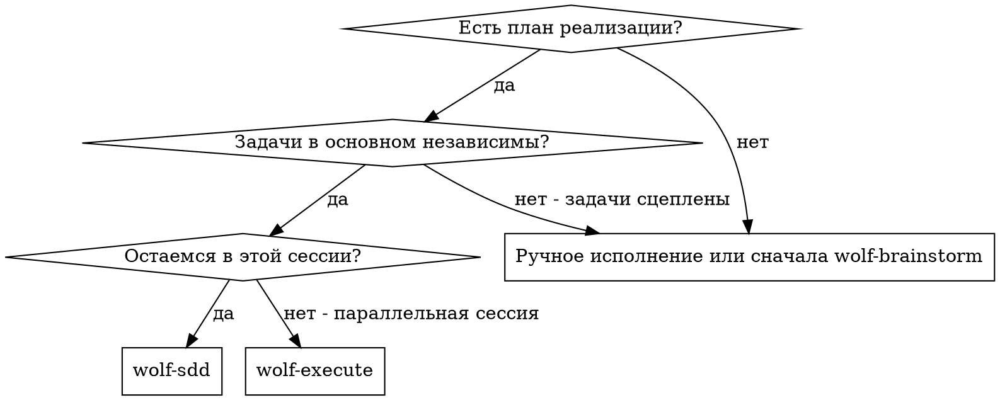
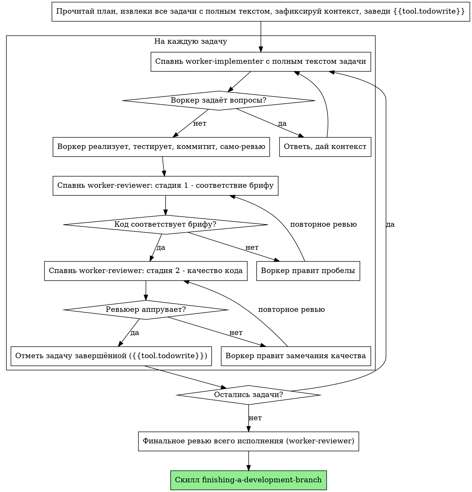

# wolf-sdd: разработка через субагентов

Исполняй план, диспетчеризуя свежего воркера на каждую задачу, с двухстадийным ревью после каждой: сначала соответствие брифу, затем качество кода.

**Почему субагенты:** ты делегируешь задачи специализированным воркерам с изолированным контекстом. Точно формулируя их инструкции и контекст, ты удерживаешь их в фокусе и обеспечиваешь успех. Воркеры никогда не наследуют контекст и историю твоей сессии — ты конструируешь ровно то, что им нужно. Это же бережёт твой контекст для координации.

**Ядро принципа:** свежий воркер на задачу + двухстадийное ревью (бриф → качество) = высокое качество, быстрая итерация.

**Роли:** диспетчеризация — через executor-lead (или напрямую `{{tool.task}}` с типом воркера): исполнение — worker-implementer, ревью обеих стадий — worker-reviewer. Generic-субагентов не спавнь.

**Методики воркеров:** воркер перед задачей подтягивает своё лицо из памяти — `wolf search "worker-implementer playbook"` / `wolf search "worker-reviewer playbook"` (брать наибольшую версию); в брифе укажи это воркеру, если harness не доставляет лица автоматически.

## REQUIRED-предусловие: worktree

**До старта исполнения worktree ОБЯЗАН существовать:** `.worktrees/<имя-задачи>` внутри проекта (правило проекта). Trunk-based: main — истина, работа идёт в ветке внутри worktree. Нет worktree — создай его ДО первой задачи (см. скилл using-git-worktrees). Никогда не начинай исполнение в main без явного согласия владельца.

## Когда использовать



**vs wolf-execute (параллельная/линейная сессия):**
- Та же сессия (без переключения контекста)
- Свежий воркер на задачу (без загрязнения контекста)
- Двухстадийное ревью после каждой задачи: сначала бриф, затем качество
- Быстрее итерация (без человека между задачами)

## Ход процесса



## Тиринг задач

Используй наименее мощную модель, которая справится с ролью — это экономит стоимость и время. Конкретные имена моделей — зона конфига проекта (тиринг), не этого скилла.

**Механические задачи реализации** (изолированные функции, ясные брифы, 1–2 файла): быстрая воркерская модель. Большинство задач механичны при хорошо написанном плане.

**Интеграционные задачи и задачи суждения** (координация многих файлов, сопоставление паттернов, дебаг): стандартная модель.

**Архитектура, дизайн и ревью:** самая способная доступная модель.

**Сигналы сложности задачи:**
- Трогает 1–2 файла с полным брифом → воркерская модель
- Трогает много файлов с интеграционными рисками → стандартная
- Требует дизайнерского суждения или широкого понимания кодовой базы → самая способная

## Обработка статусов воркера

Воркеры (worker-implementer) отчитываются одним из четырёх статусов. Обрабатывай каждый соответственно:

**DONE:** переходи к ревью соответствия брифу.

**DONE_WITH_CONCERNS:** воркер закончил, но обозначил сомнения. Прочитай их до продолжения. Сомнения о корректности или scope — уладь до ревью. Наблюдения («файл разрастается») — зафиксируй (`wolf add --type lesson`, если переиспользуемо) и переходи к ревью.

**NEEDS_CONTEXT:** воркеру не хватило информации. Дай недостающий контекст и перезапусти.

**BLOCKED:** воркер не может завершить задачу. Оцени блокер:
1. Проблема контекста — дай больше контекста, перезапусти
2. Задача требует больше рассуждений — поднимись на уровень выше тирингом
3. Задача слишком велика — разбей на меньшие части
4. План сам ошибочен — эскалируй владельцу

**Никогда** не игнорируй эскалацию и не заставляй ту же модель ретраить без изменений. Если воркер сказал, что застрял, — что-то должно измениться.

## Пример цикла

```
Ты: использую wolf-sdd для исполнения плана.

[Читаю план один раз: docs/plans/feature-plan.md]
[Извлекаю все 5 задач с полным текстом и контекстом]
[Заведи {{tool.todowrite}} со всеми задачами]

Задача 1: скрипт установки хука.

[Спавню worker-implementer через executor-lead: полный текст задачи + контекст]

Воркер: «До старта — хук ставится на уровне пользователя или системы?»
Ты: «На уровне пользователя.»

Воркер: [позже]
  - Реализовал команду install-hook
  - Тесты 5/5 зелёные
  - Само-ревью: заметил пропуск --force, добавил
  - Закоммитил

[Спавню worker-reviewer, стадия 1: соответствие брифу]
Ревьюер: ✅ Соответствует брифу — все требования закрыты, лишнего нет.

[Спавню worker-reviewer, стадия 2: качество кода]
Ревьюер: Сильные стороны: покрытие тестами, чисто. Замечаний нет. Approved.

[Отмечаю задачу 1 завершённой]
... [далее задачи 2..N аналогично, финальное ревью всего исполнения]
```

## Преимущества и цена

**vs ручное исполнение:** воркеры естественно следуют TDD; свежий контекст на задачу (без путаницы); параллельная безопасность (воркеры не мешают друг другу — но НЕ диспетчь несколько исполнителей concurrently, конфликты); воркер может задавать вопросы до и во время работы.

**vs wolf-execute:** та же сессия (без handoff); непрерывный прогресс; ревью-чекпоинты автоматичны.

**Эффективность:** нет накладных расходов на чтение файлов (диспетчер даёт полный текст); диспетчер курирует ровно нужный контекст; вопросы всплывают до работы, а не после.

**Гейты качества:** само-ревью ловит проблемы до сдачи; двухстадийное ревью (бриф → качество); циклы ревью гарантируют, что правки реально работают; соответствие брифу страхует от over/under-building; стадия качества — что реализация хорошо сделана.

**Цена:** больше вызовов воркеров (исполнитель + 2 ревью на задачу); диспетчер готовит больше (извлечение всех задач upfront); циклы ревью добавляют итераций; но ловят проблемы рано (дешевле, чем дебаг потом).

## Red Flags

**Никогда:**
- Не начинай исполнение в main без явного согласия владельца (работа — только в worktree-ветке)
- Не пропускай ревью (соответствие брифу ИЛИ качество — оба обязательны)
- Не продолжай с незакрытыми замечаниями
- Не диспетчь несколько воркеров-исполнителей параллельно (конфликты)
- Не заставляй воркера читать файл плана (давай полный текст)
- Не пропускай установочный контекст (воркер обязан понимать, куда задача встраивается)
- Не игнорируй вопросы воркера (ответь до продолжения работы)
- Не принимай «примерно соответствует» по брифу (ревьюер нашёл проблемы = не готово)
- Не пропускай циклы ревью (ревьюер нашёл = воркер правит = ревью заново)
- Не позволяй само-ревью воркера заменить настоящее ревью (нужно и то и другое)
- **Не начинай ревью качества до ✅ по соответствию брифу** (порядок нарушен)
- Не переходи к следующей задаче, пока любое из ревью имеет открытые замечания

**Если воркер задаёт вопросы:**
- Отвечай ясно и полностью
- Дай дополнительный контекст при необходимости
- Не подгоняй его к реализации

**Если ревьюер нашёл проблемы:**
- Правит тот же воркер-исполнитель
- Ревьюер смотрит снова
- Повторять до аппрува
- Не пропускай повторное ревью

**Если воркер завалил задачу:**
- Спавнь чинящего воркера с точными инструкциями
- Не чини сам (загрязнение контекста)

## Интеграция

**Обязательные скиллы воркфлоу:**
- **using-git-worktrees** — REQUIRED: изолированный worktree `.worktrees/<имя-задачи>` ДО старта исполнения
- **wolf-plan** — создаёт план, который этот скилл исполняет
- **requesting-code-review** — рамка ревью для воркеров-ревьюеров
- **finishing-a-development-branch** — завершение разработки после всех задач

**Воркеры используют:**
- **test-driven-development** — воркеры следуют TDD на каждой задаче

**Альтернатива:**
- **wolf-execute** — линейное исполнение без субагентов, когда диспетчеризация недоступна

---

## Трассировка адаптации

> Источник: `~/.config/opencode/superpowers/skills/subagent-driven-development/SKILL.md`, upstream 6efe32c (2026-04-23)

| Пункт источника | Судьба | Почему |
|---|---|---|
| «Fresh subagent per task + two-stage review» | сохранено | Ядро принципа |
| «Why subagents» (изоляция контекста) | сохранено | Ядро |
| When-to-use флоучарт | сохранено; executing-plans → wolf-execute | Рёбра набора |
| Process-флоучарт | сохранено; диспетч субагентов → executor-lead/worker-implementer/worker-reviewer; TodoWrite → `{{tool.todowrite}}` | Research §1: диспетч субагентов непереносим — заменён ролями Wolf |
| Model Selection | заменено → тиринг проекта без имён моделей | Research §1: выбор моделей непереносим |
| Implementer Status (DONE/DONE_WITH_CONCERNS/NEEDS_CONTEXT/BLOCKED) | сохранено полностью (4/4) | Контракт статусов воркера |
| Prompt-templates (3 sibling-файла) | отброшено | Файлы каталога скилла не переносятся; заменено ролями worker-* |
| Example Workflow | сжато сохранено; сущность цикла сохранена | Иллюстрация |
| Advantages/Cost | сохранено сжато | Ядро |
| Red Flags «Never» (12) | сохранено полностью (12/12); main/master → trunk-based формулировка | H7 |
| «Если спрашивает / нашёл / завалил» (3+4+2) | сохранено полностью (9/9) | H7 |
| Integration | заменено: worktrees → H5-предусловие `.worktrees/<имя-задачи>`; writing-plans → wolf-plan; code-reviewer → worker-reviewer; TDD — воркерам | Wolf-переплетение |
| — | добавлено: REQUIRED-предусловие worktree (H5) | Спека §5.2 |

Перенесённые списки: «Never» 12/12, вспомогательные 3+4+2 (9/9), статусы воркера 4/4.
